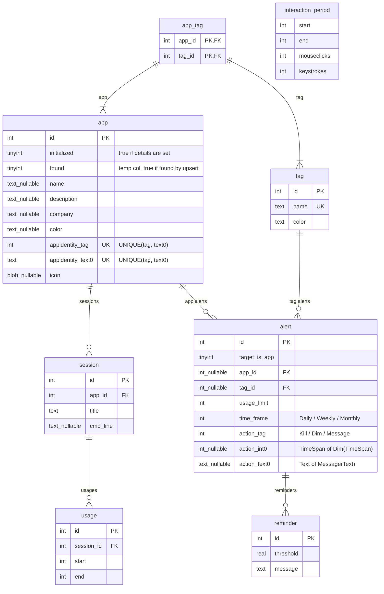

# Architecture

## ER Diagram

```mermaid
erDiagram
    app {
        int             id PK
        tinyint         initialized "true if details are set"
        tinyint         found   "temp col, true if found by upsert"
        text_nullable   name
        text_nullable   description
        text_nullable   company
        text_nullable   color
        int             appidentity_tag     UK "UNIQUE(tag, text0)"
        text            appidentity_text0   UK "UNIQUE(tag, text0)"
        blob_nullable   icon
    }

    tag {
        int             id PK
        text            name UK
        text            color
    }

    app_tag {
        int             app_id PK,FK
        int             tag_id PK,FK
    }

    session {
        int             id PK
        int             app_id FK
        text            title
        text_nullable   cmd_line
    }

    usage {
        int             id PK
        int             session_id FK
        int             start
        int             end
    }

    interaction_period {
        int             start
        int             end
        int             mouseclicks
        int             keystrokes
    }

    alert {
        int             id PK
        tinyint         target_is_app
        int_nullable    app_id FK
        int_nullable    tag_id FK
        int             usage_limit
        int             time_frame      "Daily / Weekly / Monthly"
        int             action_tag      "Kill / Dim / Message"
        int_nullable    action_int0     "TimeSpan of Dim(TimeSpan)"
        text_nullable   action_text0    "Text of Message(Text)"
    }

    reminder {
        int             id PK
        real            threshold
        text            message
    }

    app ||--o{ session : sessions
    session ||--o{ usage : usages
    app_tag ||--|{ app : app
    app_tag ||--|{ tag : tag
    app ||--o{ alert : "app alerts"
    tag ||--o{ alert : "tag alerts"
    alert ||--o{ reminder : reminders
```