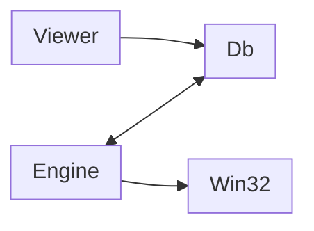

# Architecture

High-level architecture design document to show how the components interact with each other.

The Engine talks to the Win32 platform to fetch usage events, and saves them to the Db.
The Viewer talks to the Db to fetch information and displays them.
