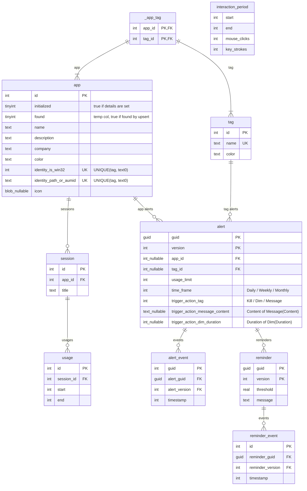

# Architecture

## Data

### ER Diagram

### Entities

1. [App](./src/Cobalt.Common.Data/Entities/App.cs): An actual app on the system. Uniquely identified by its [AppIdentity](./src/Cobalt.Common.Data/Entities/App.cs), but we use an `Id` as the Primary Key for performance reasons.
1. [Session](./src/Cobalt.Common.Data/Entities/Session.cs): To keep track of an app and its window titles. A session can be reset if the app is closed or system shutdown. Titles are _not_ unique.
1. [Usage](./src/Cobalt.Common.Data/Entities/Usage.cs): A single, continuous usage of an app during a session. Idling might occur, but that is kept track seperately using interaction periods.
1. [InteractionPeriod](./src/Cobalt.Common.Data/Entities/InteractionPeriod.cs): A period of interaction (mouselicks / keystrokes). Once the user spents time idle, an entry is made that ends when the idle begins.
1. [Alert](./src/Cobalt.Common.Data/Entities/Alert.cs): Record stating that we track an app or tag and perform an action (`Kill`/`Message(Content)`/`Dim(Duration)`) once the usage limit is hit, per day/ week / month.
1. [Reminder](./src/Cobalt.Common.Data/Entities/Reminder.cs): Record stating that for a certain threshold from an alert's usage limit, we should display a message warning the user.
1. [AlertEvent](./src/Cobalt.Common.Data/Entities/AlertEvent.cs): A log of the Alert firing. Used to prevent multiple firings of the same alert, and to show the user how useful their alert is.
1. [ReminderEvent](./src/Cobalt.Common.Data/Entities/ReminderEvent.cs): A log of the Reminder firing. Used to prevent multiple firings of the same reminder, and to show the user how useful their reminder is.

Alert and Reminders have a randomly generated guid and (initially `1`) version as their composite key. This is to tag that an
AlertEvent fired for a specific version of an Alert; Alerts will have different versions if they are modified.

If an AlertEvent exists for an Alert's time frame when the usage limit is 5 minutes, it indicates that we do not need to perform the trigger action (e.g. `Message`) again in that time frame.
However, when the user modifies it to 7 hours, or changes the target to a different app, that AlertEvent should not be tagged to this new version of alert and prevent firing the new version of the Alert.
Indeed, what we do is we duplicate the Alert but increment the version (with the changes to the Alert already recorded), then duplicate the Reminders, but clear the AlertEvents and ReminderEvents.
We have an optimization when there are no AlertEvents or ReminderEvents for an Alert at all yet; we can just modify the Alert without incrementing the version.

We apply a similar set of rules for Reminders and ReminderEvents.

### Data Access Layer
We use EntityFramework as an ORM over the actual SQLite database. SQLite is enabled
with default `journal=WAL` since we want multi-process writes (Cobalt and Cobalt.Engine).

We use SQLite since it's heavily battle-tested and we need fast reads. It integrates very well with EntityFramework (except for the [lack of async](https://learn.microsoft.com/en-us/dotnet/standard/data/sqlite/async))
and has a [good Rust library](https://github.com/rusqlite/rusqlite).

We use EntityFramework since our queries get annoyingly complicated quickly, so we can sacrifice some performance in query translation and instead get major ergonomics wins.

## ViewModels

## Infrastructure

## Views

## Tests
