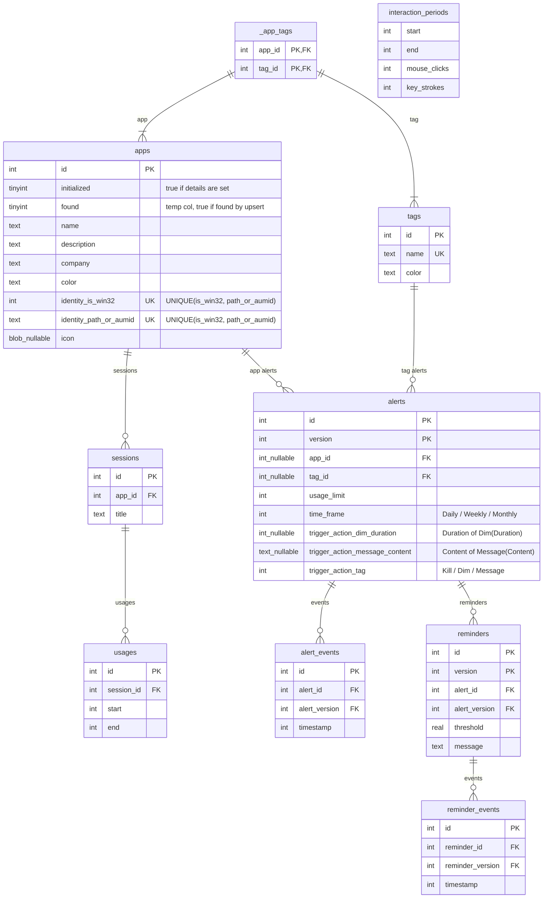

# Architecture

## Data

### ER Diagram

### Entities

1. [App](./src/Cobalt.Common.Data/Entities/App.cs): An actual app on the system. Uniquely identified by its [AppIdentity](./src/Cobalt.Common.Data/Entities/App.cs), but we use an `Id` as the Primary Key for performance reasons.
Icons are stored as blobs. Notably, when an App is inserted not all fields might be initialized, there will be a slightly delay where the Engine finds the actual details to fill in. But the insertion happens first since we need to insert the session and usage as well.
1. [Session](./src/Cobalt.Common.Data/Entities/Session.cs): To keep track of an app and its window titles. A session can be reset if the app is closed or system shutdown. Titles are _not_ unique.
1. [Usage](./src/Cobalt.Common.Data/Entities/Usage.cs): A single, continuous usage of an app during a session. Idling might occur, but that is kept track seperately using interaction periods.
1. [InteractionPeriod](./src/Cobalt.Common.Data/Entities/InteractionPeriod.cs): A period of interaction (mouselicks / keystrokes). Once the user spents time idle, an entry is made that ends when the idle begins.
1. [Tag](./src/Cobalt.Common.Data/Entities/Tag.cs): A collection of apps under a common name e.g. Gaming, Productivity
1. [Alert](./src/Cobalt.Common.Data/Entities/Alert.cs): Record stating that we track an app or tag and perform an action (`Kill`/`Message(Content)`/`Dim(Duration)`) once the usage limit is hit, per day/ week / month.
1. [Reminder](./src/Cobalt.Common.Data/Entities/Reminder.cs): Record stating that for a certain threshold from an alert's usage limit, we should display a message warning the user.
1. [AlertEvent](./src/Cobalt.Common.Data/Entities/AlertEvent.cs): A log of the Alert firing. Used to prevent multiple firings of the same alert, and to show the user how useful their alert is.
1. [ReminderEvent](./src/Cobalt.Common.Data/Entities/ReminderEvent.cs): A log of the Reminder firing. Used to prevent multiple firings of the same reminder, and to show the user how useful their reminder is.

Alert and Reminders have an autoincremented id and (initially `1`) version as their composite key. SQLite does not have a seperate sequence type. Thus we make do using the `alert_id_seq` and `reminder_id_seq` tables that have an autoincremented integer primary key, and use them to generate ids by updating them. The version is used to tag that an
AlertEvent fired for a specific version of an Alert; Alerts will have different versions if they are modified.

If an AlertEvent exists for an Alert's time frame when the usage limit is 5 minutes, it indicates that we do not need to perform the trigger action (e.g. `Message`) again in that time frame.
However, when the user modifies it to 7 hours, or changes the target to a different app, that AlertEvent should not be tagged to this new version of alert and prevent firing the new version of the Alert.
Indeed, what we do is we duplicate the Alert but increment the version (with the changes to the Alert already recorded), then duplicate the Reminders, but clear the AlertEvents and ReminderEvents.
We have an optimization when there are no AlertEvents or ReminderEvents for an Alert at all yet; we can just modify the Alert without incrementing the version.

We apply a similar set of rules for Reminders and ReminderEvents.

### Data Access Layer
We use [EntityFramework](https://learn.microsoft.com/en-us/ef/) as an ORM over the actual [SQLite](https://www.sqlite.org/index.html) database. SQLite is enabled
with default `journal=WAL` since we want multi-process writes (Cobalt and Cobalt.Engine).

We use SQLite since it's heavily battle-tested and we need fast reads. It integrates very well with EntityFramework (except for the [lack of async](https://learn.microsoft.com/en-us/dotnet/standard/data/sqlite/async))
and has a [good Rust library](https://github.com/rusqlite/rusqlite).

We use EntityFramework ([SQLite driver](https://learn.microsoft.com/en-us/ef/core/providers/sqlite/?tabs=dotnet-core-cli)) since our queries get annoyingly complicated quickly, so we can sacrifice some performance in query translation and instead get major ergonomics wins.

It's configured such that we have a connection pool of our DbContext (called [QueryContext](./src/Cobalt.Common.Data/QueryContext.cs)) set up during service injector startup.

## ViewModels
We use both [ReactiveUI](https://github.com/reactiveui) and [CommunityToolkit](https://learn.microsoft.com/en-us/dotnet/communitytoolkit/mvvm/), but we mostly use the [source generators](https://learn.microsoft.com/en-us/dotnet/communitytoolkit/mvvm/generators/overview) feature of CommunityToolkit.
ReactiveUI gives us a lot of tools like `WhenActivated`, `IViewFor<T>` and `Interaction<TInput, TOutput>` reactivity in general, but it's clunky to work with. The source generators fix that problem for us.

### Entities
The entities of the Data layer are mapped here as [derivations of EntityViewModelBase](./src/Cobalt.Common.ViewModels/Entities/EntityViewModelBase.cs). Entities that are editable derive from [EditableEntityViewModelBase](./src/Cobalt.Common.ViewModels/Entities/EntityViewModelBase.cs) and override the `Save` or `UpdateEntity` method.
The view model's fields are a _copy_ of the entities fields. References to other entities are also replaced
with their view model equivalent. There is an [EntityViewModelCache](./src/Cobalt.Common.ViewModels/Entities/EntityViewModelCache.cs) that caches entity Ids to weak references of the view models so that we don't have a lot of view models being created, and to handle updates easily since the view models are the same reference.

### Pages
We have 5 main pages (`Home`, `Apps`, `Tags`, `Alerts`, `History`) and corresponding view models for them. There is also a `MainViewModel` that ties them all together.
During debug mode, there is an additional page called `Experiments`.

### Dialogs
Dialogs inherit from [DialogViewModelBase\<T>](./src/Cobalt.Common.ViewModels/Dialogs/DialogViewModelBase.cs) where `T` is the result type of the dialog. Dialogs support asynchronous actions
in their Primary button clicks and can have validity checks.

### Validation
Validation is done by implementing the `IValidatorViewModel` interface, which only includes the `ValidationContext`. Extension methods exists to add validation rules via
`this.ValidationRule(vmProperty, expr, message)` and other overloads. Note that you can bind validation rules to specific properties of the view model (triggers the red underline), or you can bind them
to the entire view model itself (only triggers the `IsValid` property).

## Infrastructure
We use use common `Microsoft.Extension.*` libraries like `DependencyInjection`, `Logging` and `Configuration` to handle our infrastructural needs.
For logging, we wrap around [Serilog.Sinks.File](https://github.com/serilog/serilog-sinks-file) since there is no built-in equivalent. Log file management is 30-days long rolling files.

This is derived from the configuration at [appsettings.json](./appsettings.json) and merged with the [debug config](./dbg/appsettings.Debug.json).

## Views
Our entire UI layer is implemented using the [Avalonia](https://docs.avaloniaui.net/) framework. We use Fluent Design principles and [libraries](https://github.com/amwx/FluentAvalonia) to retain the "Windows utilities" look.

The views that map to a view model inherit from `ReactiveUserControl<TViewModel>`.

Our main window has a NavigationView that allows us to traverse between the pages.
During debug mode, there is an additional page called `Experiments`.

## Tests
We use [xUnit](https://github.com/xunit/xunit) to test our components. Tests are organized into their own file based on their component e.g. [DataTests.cs](./src/Cobalt.Tests/DataTests.cs).
