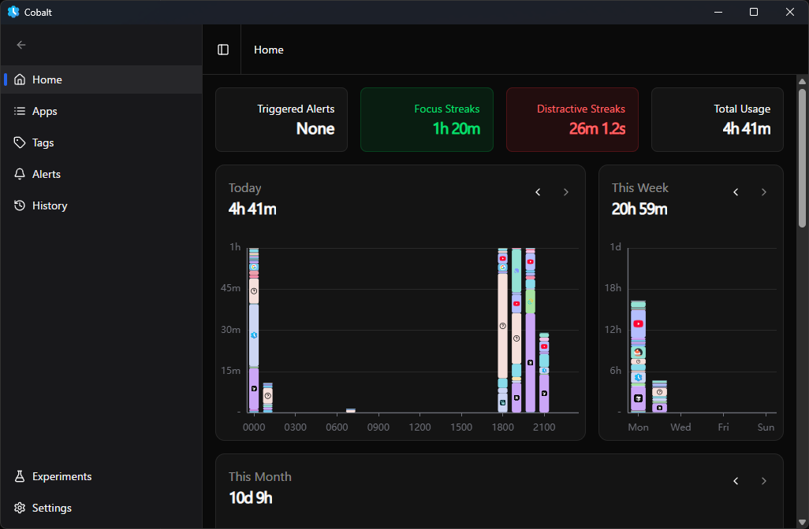
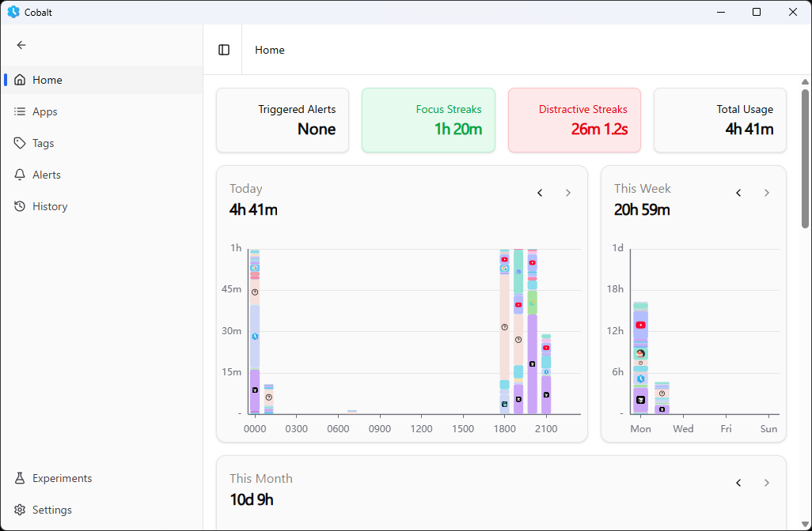
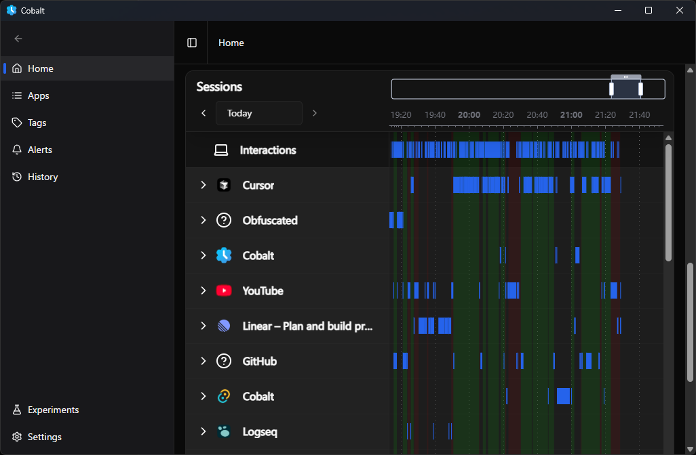
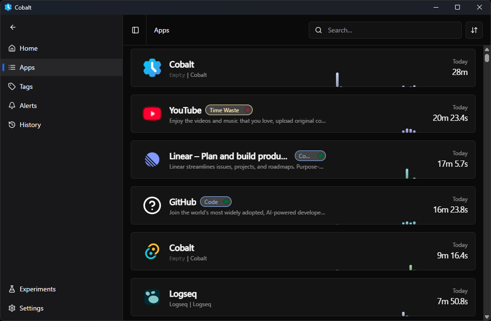
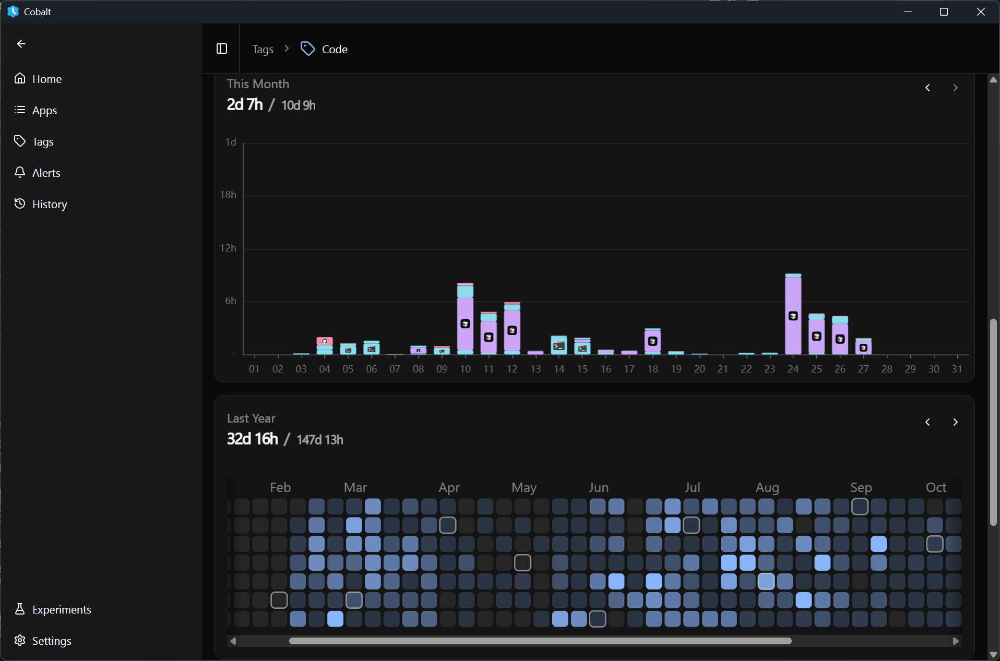
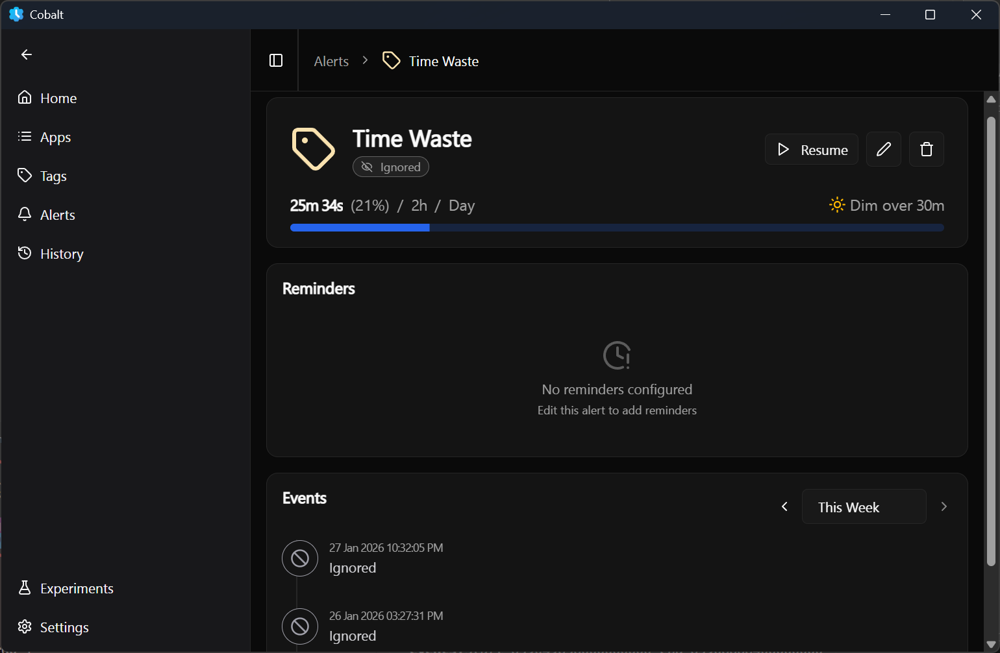
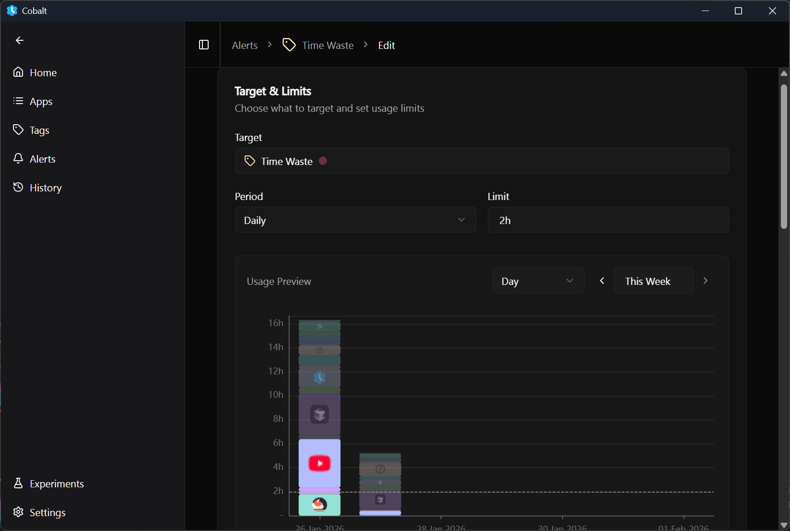
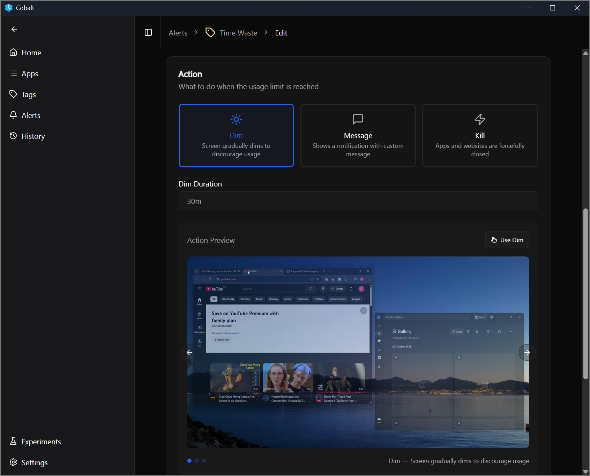
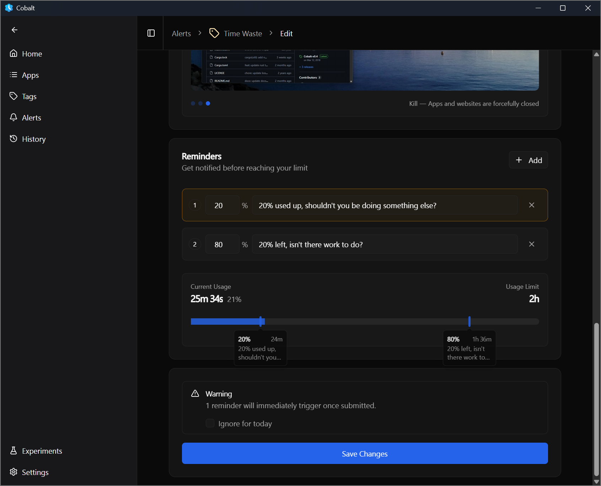
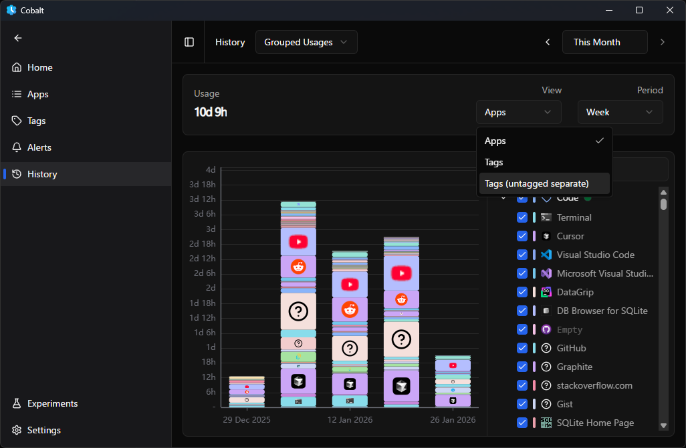

# Cobalt

View usage statistics of all your apps. Track and determine where you are wasting time, and get your procrastination under control.

<p align="center">
  
</p>

<details>
  <summary><strong>Show more screenshots</strong></summary>

  <br />

  <p align="center">
    
    <br />
    Home Page (light mode)
  </p>

  <p align="center">
    
    <br />
    Home Page (Streaks)
  </p>

  <p align="center">
    
    <br />
    Apps Page
  </p>

  <p align="center">
    
    <br />
    Tag Page
  </p>

  <p align="center">
    
    <br />
    Tag Page (Histogram)
  </p>

  <p align="center">
    
    <br />
    Alerts Page
  </p>

  <p align="center">
    
    <br />
    Alert Page
  </p>

  <p align="center">
    
    <br />
    Edit Alert Page (Usage Preview)
  </p>

  <p align="center">
    
    <br />
    Edit Alert Page (Action Preview)
  </p>

  <p align="center">
    
    <br />
    Edit Alert Page (Reminder Preview)
  </p>

  <p align="center">
    
    <br />
    History
  </p>

</details>

> [!WARNING]
> This project is mostly production-ready, but sometimes Chrome might
> slow down by 2-5%. If this becomes noticible, please report it so that I can trace the issue!

## Docs
See the [ARCHITECTURE.md](./docs/ARCHITECTURE.md) for an overview of the project.

More detailed developer guides:
- General: [DEV_GUIDE.md](./docs/DEV_GUIDE.md)
- Engine: [DEV_GUIDE_Engine.md](./docs/DEV_GUIDE_Engine.md)
- UI: [DEV_GUIDE_UI.md](./docs/DEV_GUIDE_UI.md)

## Running

```bash
# Install UI dependencies
bun i
# Build all
cargo build

# Run the UI
bun dev
# Run the Engine
cargo run --bin engine

# Test
cargo test
```