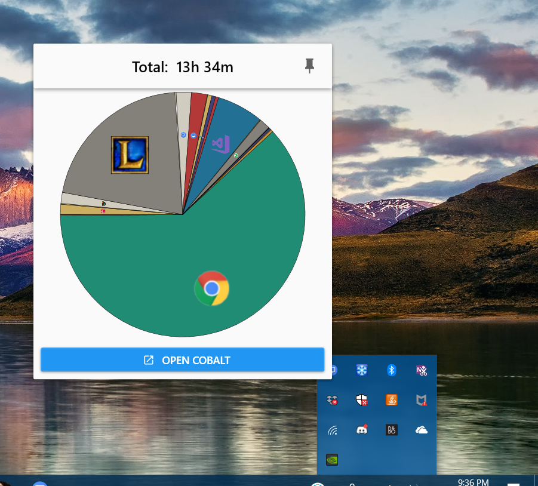

<h1 align="center">
   Cobalt
</h1>

<h3 align="center">An app usage viewer, made using C# and XAML</h3>

  

## Features
Tracks how long an app is on the screen, and displays useful statistics in a interactive, useful manner.

## Screenshots

//TODO Cobalt

 

## Mechanism
- [Cobalt.Engine](/Cobalt.Engine) and [Cobalt.TaskbarNotifier](/Cobalt.TaskbarNotifier) are started at system user login.
- A hook to the windows EVENT_SYSTEM_FOREGROUND event is added, and [window foreground changes are tracked](/Cobalt.Engine/AppWatcher.cs) in [Cobalt.Engine](/Cobalt.Engine).
- The app usage is stored into a SQLite database, and also transmitted to listeners such as [Cobalt](/Cobalt) and [Cobalt.TaskbarNotfier](/Cobalt.TaskbarNotifier)
- Listeners track existing app usages and newly added app usages and visualize them 

 

## Performance
- [Cobalt.Engine](/Cobalt.Engine) takes up ~0% of CPU and ~10mb of memory
- [Cobalt](/Cobalt) is a WPF XAML App, and includes quite a few libraries, so it takes up more memory and CPU
- [Cobalt.TaskbarNotifier](/Cobalt.TaskbarNotifier) is a WPF XAML App, but only shows a taskbar icon instead of a full window, but still includes some libraries so it might take up ~30mb of memory, ~0% of CPU when not shown and ~35mb of memory, 3% to 8% of CPU when shown.

 

## Privacy
- Is my data sent to anybody else?
  - No, it is just stored locally inside a SQLite database
- Is there any encryption/data protection scheme?
  - There is protection against [JSON Serialization Vulnerabilities](https://www.blackhat.com/docs/us-17/thursday/us-17-Munoz-Friday-The-13th-Json-Attacks.pdf), but no encryption scheme as of yet.
  
 

