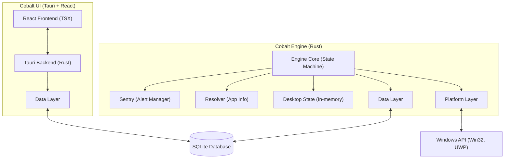
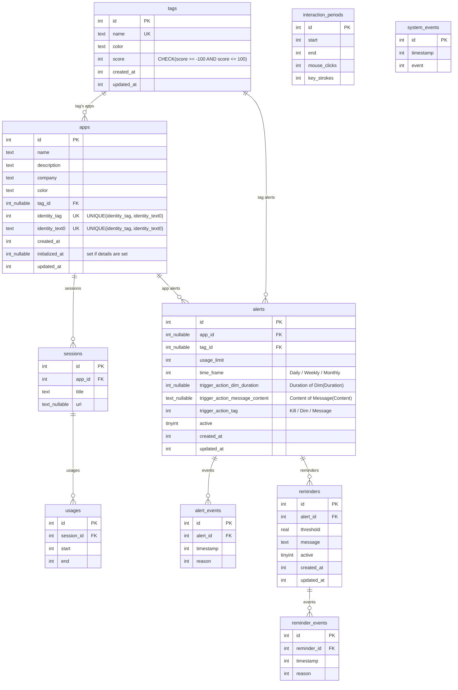

# Architecture

High-level architecture design document to show how the components interact with each other. For more
information, see the [General Dev Guide](./DEV_GUIDE.md), the [Engine Dev Guide](./DEV_GUIDE_Engine.md) and the [UI Dev Guide](./DEV_GUIDE_UI.md).

## Overview

Cobalt consists of two main components:

1. **Engine**: A Rust-based background process that tracks application usage, monitors system events, and manages alerts.
2. **UI (Viewer)**: A Tauri + React frontend that visualizes the collected data and allows users to configure alerts.

The two components communicate through a shared SQLite database.

## High-Level Component Diagram

## Data Flow

1. The Engine monitors the system through platform-specific APIs (Win32, UWP)
   * Foreground window, process, and system event monitoring
1. Usage, Session, App, and SystemEvent data is collected and stored in the SQLite database
1. The UI retrieves data from the database for visualization
   * Engine retrieves the same information for alerting and reminders
1. Configuration changes in the UI affect how the Engine processes and responds to events

## Key Components

### Engine Components

#### Engine Core

The Engine Core is a state machine that processes events from the platform layer and coordinates other components. It runs in a loop and reacts to events.

- **Primary File**: `src/engine/src/engine.rs`
- **Responsibilities**:
  - Watching foreground windows, user interactions and system events
  - Insert app, session, and usage records into the database when events occur
  - Insert user interaction periods and system events into the database
  - Coordinate with Resolver to get app info ([Resolver](/src/engine/src/resolver.rs))
  - Periodically check for alerts and reminders and execute actions ([Sentry](/src/engine/src/sentry.rs))

### Platform Layer

The Platform layer provides abstractions over Win32 platform-specific APIs.

- **Directory**: `src/platform/src/`
- **Key Components**:
  - **Objects** (`objects/mod.rs`): Windows, processes, and timestamp abstractions
  - **Web** (`web/mod.rs`): Web browser abstractions
  - **Events** (`events/mod.rs`): Watchers for system interaction and foreground events
  - **Errors** (`error.rs`): Platform-specific error handling
  - Other helpers and utilities

Objects are usually wrappers over their corresponding Win32 API. Events use Win32 Event APIs (e.g. `SetWinEventHook`)
as well as polling to detect changes.

### Data Layer

The Data layer manages database operations and provides an interface for both the Engine and UI.

- **Directory**: `src/data/src/`
- **Key Components**:
  - **Database** (`db/mod.rs`): SQLite connection and query execution
    - There are also helpers for inserting and querying data for specific components .e.g. UsageWriter.
  - **Migrations** (`migrations/mod.rs`): Database schema versioning
  - **Repository** (`db/repo{,_*}.rs`): Complex queries used by the UI

### UI Layer

#### Tauri Backend

The Tauri backend acts as a bridge between the React frontend and the Rust code.

- **Primary File**: `src/ui/src-tauri/src/lib.rs`
- **Responsibilities**:
  - Register commands for the React frontend to call
  - Provide an API for accessing the database and system functions
  - Handle serialization and error handling

#### React Frontend

The React-based UI for visualizing usage info and configuring the system.

- **Directory**: `src/ui/app/`
- **Key Components**:
  - **Routes**: Different views for apps, tags, alerts, history, and settings
  - **State Management**: Global state using Zustand and Immer
  - **Components**: Reusable UI elements built with shadcn and Tailwind CSS, visualizations built by ECharts and Recharts.

## Database Schema

The SQLite database stores all tracked data and configuration. Key entities are:

- **App**: An actual app on the system. Uniquely identified by its AppIdentity, but we use an Id as the Primary Key for performance reasons. Icons are stored in the filesystem, in `%LOCALAPPDATA%\me.enigmatrix.cobalt\icons\*` in release mode and `.\icons\*` in debug mode. Notably, when an App is inserted not all fields might be initialized, there will be a slight delay where the Engine finds the actual details to fill in using Resolver. But the insertion happens first since we need to insert the session and usage as well.
- **Session**: To keep track of an app and its window titles. A session can be reset if the app is closed or system shutdown. Titles are not unique.
- **Usage**: A single, continuous usage of an app during a session. Idling might occur, but that is kept track separately using interaction periods.
- **InteractionPeriod**: A period of interaction (mouse clicks / keystrokes). Once the user spends time idle, an entry is made that ends when the idle begins.
- **SystemEvent**: A system event such as shutdown, logoff, lock, unlock, suspend, resume, monitor on, monitor off.
- **Tag**: A collection of apps under a common name e.g. Gaming, Productivity
- **Alert**: Record stating that we track an app or tag and perform an action (Kill/Message(Content)/Dim(Duration)) once the usage limit is hit, per day/ week / month.
- **Reminder**: Record stating that for a certain threshold from an alert's usage limit, we should display a message warning the user.
- **AlertEvent**: A log of the Alert firing. Used to prevent multiple firings of the same alert, and to show the user how useful their alert is.
- **ReminderEvent**: A log of the Reminder firing. Used to prevent multiple firings of the same reminder, and to show the user how useful their reminder is.

Alert and Reminders, when duration-related fields are edited (`target`, `usage_limit`, `time_frame`, Reminder's `threshold`) and there is a corresponding AlertEvent / ReminderEvent, create a new version of the themselves and mark the previous ones as inactive (active = 0). This is to prevent the same Alert or Reminder from losing their historical AlertEvent and ReminderEvents.

If an AlertEvent exists for an Alert's time frame when the usage limit is 5 minutes, it indicates that we do not need to perform the trigger action (e.g. Message) again in that time frame. However, when the user modifies it to 7 hours, or changes the target to a different app, that AlertEvent should not be tagged to this new version of Alert and prevent firing it. Indeed, what we do is we duplicate the Alert (with the changes to the Alert already recorded), then duplicate the Reminders, but not duplicate the AlertEvents and ReminderEvents. We have an optimization when there are no AlertEvents or ReminderEvents for an Alert at all yet; we can just modify the Alert directly.

We apply a similar set of rules for Reminders and ReminderEvents.