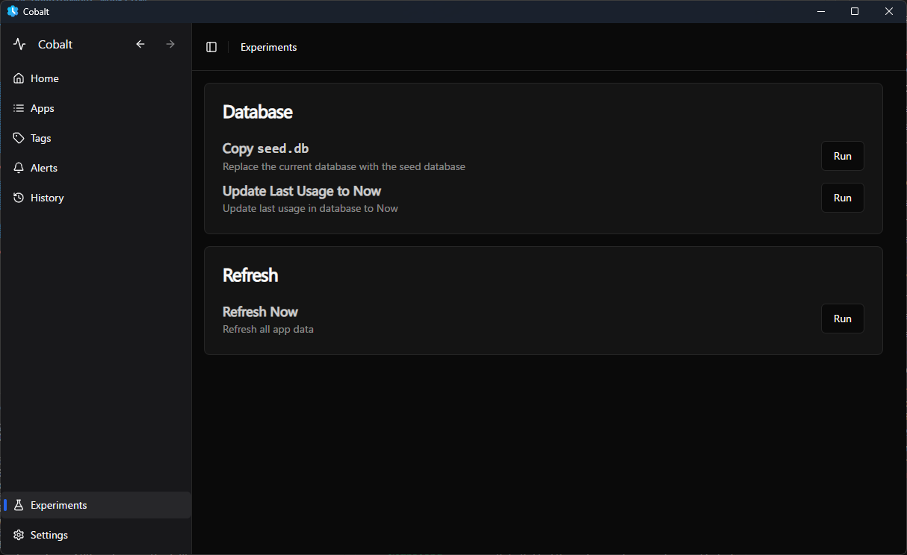

# Development Guide

This guide covers development topics that span both UI and Engine components, including the release process, bundling, installation, and other project-wide concerns. See the [Engine Dev Guide](./DEV_GUIDE_Engine.md) and the [UI Dev Guide](./DEV_GUIDE_UI.md) for more information on specific components.

## Project Structure

The Cobalt project is organized as a Rust workspace with multiple packages:

```
/
├── .github/                # GitHub workflows and templates
├── docs/                   # Documentation
├── dev/                    # Development files (e.g. seed.db)
├── src/                    # Source code
│   ├── engine/             # Background process for tracking app usage
│   ├── ui/                 # Tauri + React frontend
│   ├── data/               # Database layer (shared between UI and Engine)
│   ├── platform/           # Platform-specific abstractions (primarily Win32)
│   └── util/               # Utility functions and common dependencies
├── Cargo.toml              # Workspace definition
├── appsettings.json        # Configuration file for prod
└── ...
```

We use cargo workspaces to manage the project. However, instead of declaring the dependencies in the root `Cargo.toml`, we declare them in the `Cargo.toml` file of each package. For common dependencies, we use the `util` package.

## Development Workflow

### Environment Setup

1. Install Rust toolchain (nightly channel using [rustup](https://rustup.rs/))
2. Install Bun (for UI development, see [Bun](https://bun.sh/))
4. Install Visual Studio Build Tools with Windows SDK (for Win32 development - see Rust docs)

### Development Commands

```bash
# Build all
cargo build
# Install UI dependencies
cd src/ui; bun i

# Run the Engine
cargo run --bin engine
# Run the UI
cd src/ui; bun run dev

# Test
cargo test
```

If you want to run both components together with a shared database, run the Engine
with `cd src/ui/src-tauri; cargo run --bin engine` instead, since the database is in
`src/ui/src-tauri/main.db` during `bun run dev`.

When running the UI in dev mode, there is a page called `Experiments`:



This page allows you to copy the seed database from `dev/seed.db` to the database in the Engine.
The data inside is old, you will need to use `Update Last Usage to Now` and then press `Refresh`.

You can also use this page to test new features and UI changes before merging them into the main branch.


Format and Lint code periodically to keep the codebase clean:

```bash
# Engine
cargo fmt # Format code
cargo clippy # Lint code

# UI
cd src/ui; bun format:fix # Format code
cd src/ui; bun lint # Lint code
```

### Logging

Log levels can be configured in `appsettings.json` and `dev/appsettings.Debug.json` for dev mode:

```json
{
  "EngineLogFilter": "Info",
  "UiLogFilter": "Info",

   ...
}

```

Available levels: `Trace`, `Debug`, `Info`, `Warn`, `Error`.

Logs are output to the console and log files during development. Log files are stored in `src/ui/src-tauri/logs/` directory for UI, and
the current directory + `logs/` for Engine. In prod it's output to `%LOCALAPPDATA%/me.enigmatrix.cobalt/logs/`.

### Utils

We use utils to import common libraries. We use `flume` for channels, 
`config-rs` for configuration (read from `appsettings.json`, same as the Viewer), `color-eyre` for errors, `future-rs` for futures and `tracing / tracing-subscriber` for tracing. We also define our own time system (well, its traits at least) to be implemented by the `platform::objects::Timestamp`.

## Release Process

### Creating a Release

1. Update version numbers in root `Cargo.toml` (workspace.package.version)

1. Update the CHANGELOG.md file with notable changes

1. Create a release commit and tag:
   ```bash
   git add .
   git commit -m "Release vx.y.z"
   git tag vx.y.z
   git push origin main --tags
   ```
1. This will trigger a release build in the CI pipeline. Approve the build in the GitHub UI.

1. After the build is finished, a draft release is created in the GitHub UI. Edit the draft release in the GitHub UI to add the release notes.

1. Publish the release in the GitHub UI.

### CI/CD Pipeline

The project uses GitHub Actions for continuous integration and delivery:

1. **Built, Test, Lint**: Run on every commit
   - Builds the Engine and UI
   - Runs the tests
   - Runs the formatter, linter

1. **Nightly Build**: Run on every pull request / Commits to main
   - Same as above
   - Also builds the bundle and modifies nightly release with the assets

2. **Release Build**: Triggered on tag creation
   - Builds the bundle and creates a release in the GitHub UI

The workflow configuration is in `.github/workflows/`.

## Bundling and Installation

### Tauri Bundler

The Cobalt application is bundled using Tauri's bundler, which creates MSI installers for Windows.

Configuration is in `src/ui/src-tauri/tauri.conf.json` and `src/ui/src-tauri/tauri.conf.release.json`:


To build distribution packages:
```bash
cd src/ui; bun tauri build
```

Output locations:
- Windows: `target/release/bundle/msi/`

### Windows Installer (MSI)

The Windows installer is built using WiX Toolset, which is integrated with Tauri.
We mostly use the template Tauri uses, but modify some of it. Additional files (like WiX fragments)
are in `src/ui/src-tauri/installer/`.


### Installation Process

**Windows**:
   - The MSI installer handles installation to `C:\Program Files\Cobalt` (configurable, called `%INSTALLDIR%`)
   - Shortcuts are created in Start Menu and Desktop
   - A shortcut is created for `engine.exe` to set the working directory
   - The shortcut from above is registered to run at startup
   - During upgrades, the application is killed and relaunched afterwards

### Auto-updates

Cobalt uses Tauri's built-in updater mechanism. The update configuration is in `src/ui/src-tauri/tauri.conf.release.json`.
The CI process automatically signs updates during tag releases and updates during start of the UI viewer.

### Files

`%INSTALLDIR%` is `C:\Program Files\Cobalt` by default. Files are installed in these locations:

- `%LOCALAPPDATA%\me.enigmatrix.cobalt\main.db` (main database)
- `%LOCALAPPDATA%\me.enigmatrix.cobalt\logs\*` (generated by Engine and UI)
- `%LOCALAPPDATA%\me.enigmatrix.cobalt\logs\EBWebView\*` (generated by UI WebView)
- `%INSTALLDIR%\appsettings.json` (configuration)
- `%INSTALLDIR%\Cobalt.exe`
- `%INSTALLDIR%\engine.exe`
- `%INSTALLDIR%\Cobalt.Engine.lnk` (shortcut for `engine.exe` to set working directory)
- `%INSTALLDIR%\Uninstall Cobalt.link` (uninstaller)

### Database Migrations

Migrations are automatically applied when the application starts. They are defined in `src/data/src/migrations/`.

To add a new migration:
1. Create a new file in `src/data/src/migrations/` (e.g., `migration4.rs`)
2. Implement the `Migration` trait. Make sure the version is set to higher than the previous migration.
3. Add the migration to the list in `src/data/src/migrations/mod.rs`
